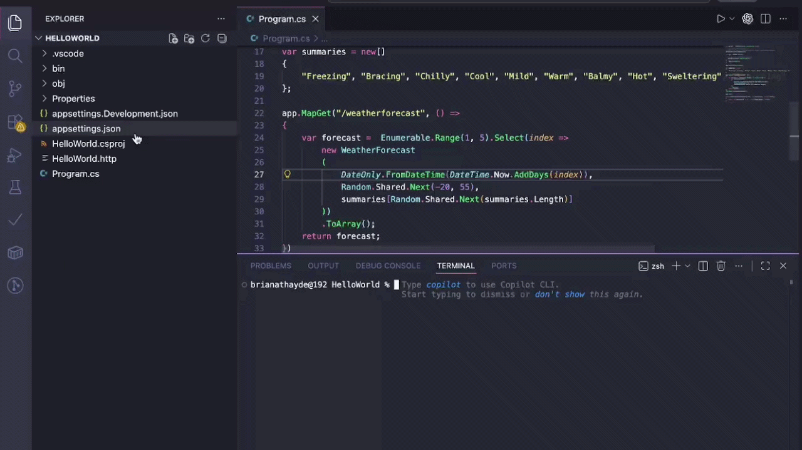
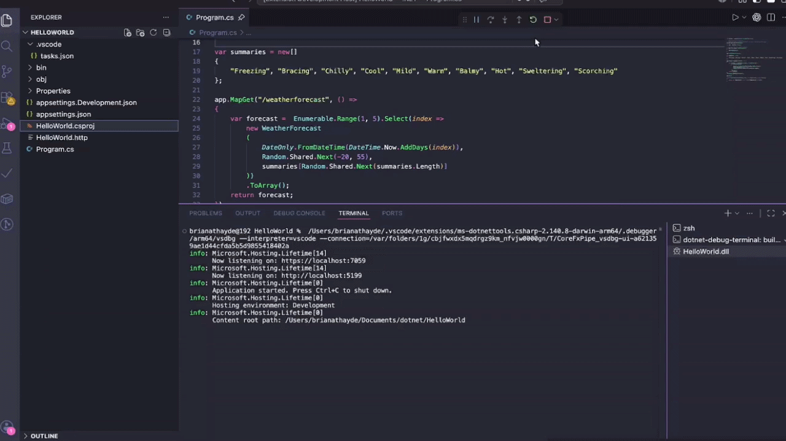

# .NET Fast Debug

A minimal VS Code extension for starting and debugging .NET projects directly from a `.csproj` file.

Right-click a `.csproj` file and select `.NET Fast Debug` > `Debug in New Terminal`.

## Features

- Builds the selected project in `Debug` configuration.
- Finds the generated `.dll` under `bin/Debug`.
- Starts the application with the VS Code `coreclr` debugger.
- Uses the integrated terminal as the application console.
- Creates or updates a `.vscode/tasks.json` build task.
- Uses that task as `preLaunchTask`, so restarting the debugger rebuilds the project first.

## Demo

### Start debugging from the `.csproj`

Use the Explorer context menu to launch the selected project without manually creating a `launch.json` entry.



### Reload debug and rebuild automatically

The green reload button in the VS Code debug toolbar works with the generated `preLaunchTask`, so restarting the session rebuilds the project before attaching again.



## Requirements

This extension depends on the official C# extension (`ms-dotnettools.csharp`), which provides the `coreclr` debugger.

You also need the .NET SDK available in your terminal path.

## Usage

1. Open a workspace that contains a .NET project.
2. Right-click a `.csproj` file in the Explorer.
3. Select `.NET Fast Debug` > `Debug in New Terminal`.
4. Use the debug toolbar reload button to restart the session with a fresh build when needed.

## Development

This section is only for contributors or anyone who wants to run the extension from source. It is not required to use the extension after installing it in VS Code.

Install project dependencies:

```bash
npm install
```

Open this folder in VS Code and press `F5` to start an Extension Development Host.

Useful scripts:

- `npm run compile`: compile the extension.
- `npm run watch`: recompile automatically during development.
- `npm run lint`: run ESLint.
- `npm test`: compile the extension.

## Packaging

Generate a local `.vsix` package:

```bash
npm run package
```

Install the generated package manually in VS Code with:

```bash
code --install-extension dotnet-fast-debug-1.0.0.vsix
```

Publish to the Visual Studio Marketplace:

```bash
npm run publish:marketplace
```

Publishing requires a Marketplace publisher account and a Personal Access Token configured for `vsce`.
